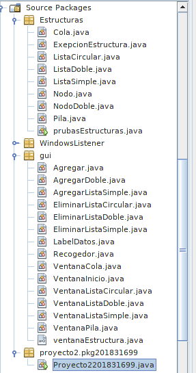
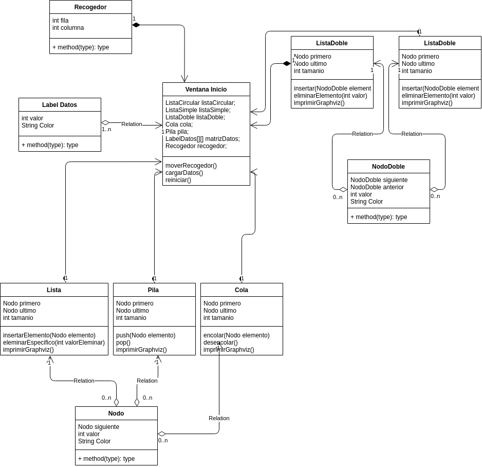

# Curso IPC1 - Vacaciones Junio 2020

## Proyecto 2 - Recogedor de bloques

> Estudiante: Ludvin Nicolás Basilio Baquiax Vásquez

> Carne: 201831699

> Junio 2020

## Tabla de Contenido

-[Descripción](#descripción)

-[Requisistos](#requisitos)

-[Metodos Utilizados](#metodos-utilizados)

-[Clases](#clases)

## Descripción

_Es un juego donde el jugador se mueva a través de un tablero para
recoger bloques de distintos valores y colores que serán almacenarlos en diferentes estructuras
dinámicas._

## Requisitos
- Linux Mint 19.3
- 8 GB de ram
- Internet.
- Tener instalado Java

## Metodos Utilizados

### Carga de Datos

_Se utiliza un file Chooser con un filtro de archivos .ipc1, se utiliza un FileReader para la lectura de datos, se guardan los datos en un String, para luego dividirlos en cada salto de linea ingresandolos en un arreglo, para luego ingresar los datos en una matriz de Datos y a su vez se agrega a la lista simple._

### Reiniciar
_Para las listas y matrices se crean nuevas instancias, y se remueven todos los bloques del panel_

### Mover Recogedor
_Se utiliza un Key Listener para mover el recogedor, en cada movimiento se valida que este en el rango segun la direccion en la que se este moviendo, y a su vez se verifaca si la casilla a la que se esta moviendo, tiene un elemento para que este se agregue a su respectiva estructura y se elimine de la matriz._

### Pila

#### Push
_Inserta un elemento y declarandolo como su siguiente al tope anterior._

#### Pop
_Elemina el top, y el nuevo tope sera el siguiente del anterior tope._

### Cola

#### Encolar
_Inserta un elemento y este se agrega en la ultima pocision._

#### Desencolar
_Elimina el primer elemento, y el nuevo primer elemento sera el siguiente del anterior siguiente._

### Lista - Lista Doble - Lista Circular

#### Agregar
_Inserta un elemento y este se agrega en la ultima pocision._

#### Eleminar
_Primero se valida si la lista tiene un elemento y que este sea el que se valla a eliminar, para vaciar la lista, si este caso no se cumple se valida si el elemento que se desea eliminar es el primero, para declarar como primero al siguiente del anterior primero y como ultimo caso, se declaran 2 nodo el que se va desea elimnar y el anterior de este, y se recorre la lista hasta encontrarlo o hasta el final de la lista, en base al nodo anterior se hace el enlace con el siguiente del que se va eliminar, si el valor no existe se retorna un error._

## Clases

## Diagrama UML

